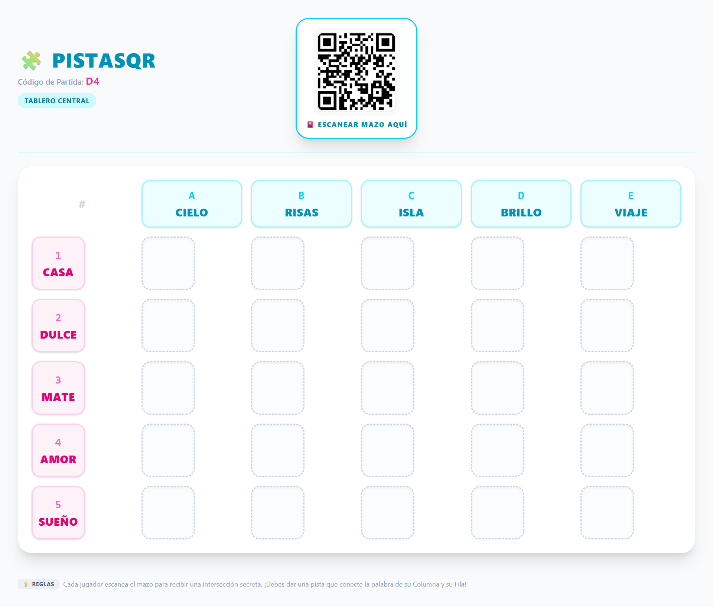
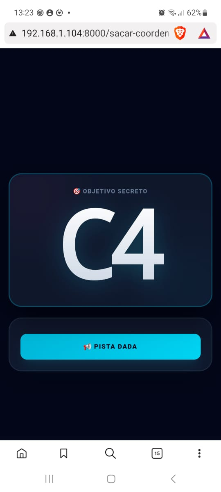

# 🎯 Qrdenadas

**Qrdenadas** es un juego educativo que combina **coordenadas**, **códigos QR** y **creatividad** para crear una experiencia interactiva de aprendizaje.

> Proyecto desarrollado con fines exclusivamente educativos y sin objetivos comerciales.

---

## 📖 ¿De qué se trata?

Los jugadores deben explorar un tablero utilizando coordenadas y escanear códigos QR para sacar del mazo una coordenada. Pensando en las palabras que componen esa coordenada debe pensar en una TERCERA PALABRA que represente esa coordenada.

---

## ✨ Características

- 📍 Uso de coordenadas para navegar el tablero.
- 📱 Escaneo de códigos QR desde dispositivos móviles.
- 🎨 Actividades orientadas a la creatividad y el aprendizaje.

---

## 🖥️ Capturas de pantalla

<h3 align="center">Tablero principal (PC) - Lo que vemos todos los jugadores</h3>

<h3 align="center">Escaneo de códigos QR (Celular) - Las pistas que sacamos del mazo</h3>

  

---

## 🚀 Tecnologías utilizadas

- Laravel 12
- PHP 8.x
- Livewiere
- Laravel Reverb
- JavaScript
- HTML5 / CSS3

---

## ⚠️ Aviso

Este proyecto se distribuye únicamente con fines educativos. No posee fines comerciales ni pretende infringir derechos de terceros.

---

## 📄 Licencia

Uso educativo y demostrativo.
